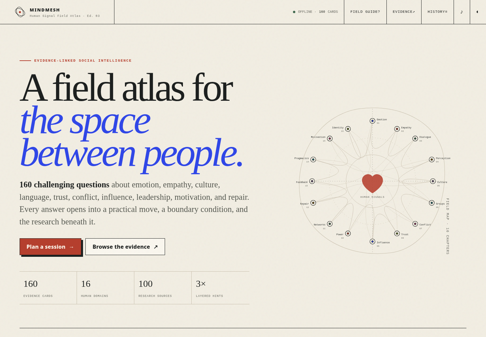
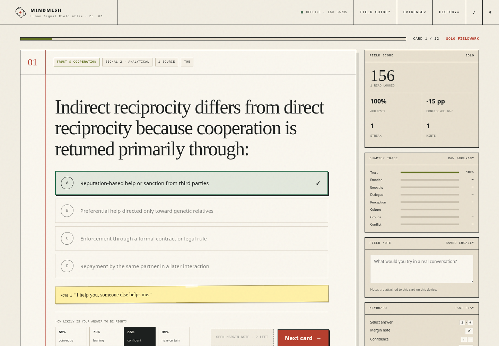
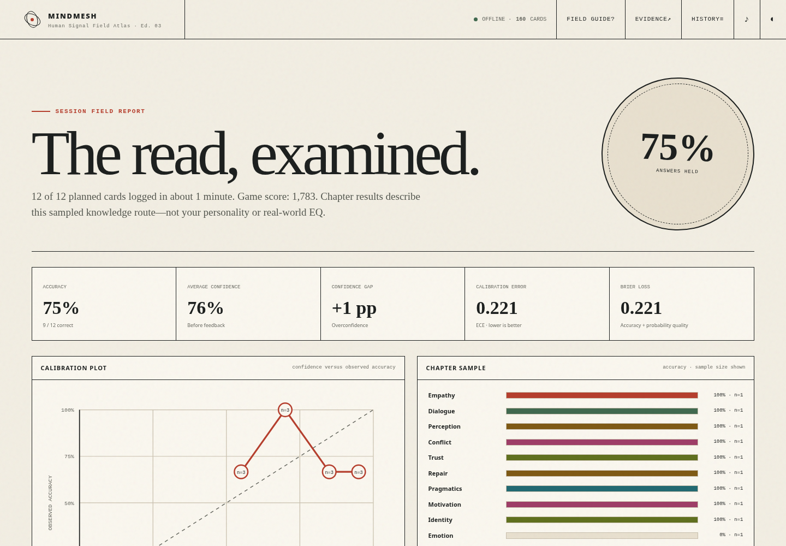
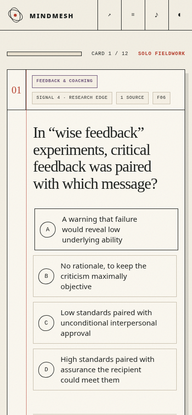

<p align="center">
  <strong>MINDMESH</strong><br>
  <em>The Human Signal Field Atlas</em>
</p>

<h1 align="center">How well do you understand people—<br>and how well do you know when you might be wrong?</h1>

<p align="center">
  An evidence-linked trivia and calibration game about emotion, empathy, dialogue, culture, conflict, trust, influence, leadership, relationships, and the hidden systems between people.
</p>

<p align="center">
  <code>160 cards</code> · <code>16 chapters</code> · <code>100 research sources</code> · <code>solo + local multiplayer</code> · <code>one self-contained HTML file</code>
</p>

<p align="center">
  
</p>

> **Most social errors do not feel like ignorance. They feel like certainty.**  
> MINDMESH turns that problem into a game: make a judgment, price your confidence, inspect the evidence, and carry one useful move into the next real conversation.

---

## Play

MINDMESH requires no installation, account, server, package manager, framework, or build step.

1. Download or clone the repository.
2. Open `mindmesh_field_atlas_v3.html` in a current browser.
3. Choose a route and begin fieldwork.

The game runs offline. Internet access is needed only when opening a cited research source.

<!-- Replace the placeholder below after publishing with GitHub Pages. -->
**Live demo:** `https://YOUR-USERNAME.github.io/YOUR-REPOSITORY/`

## What MINDMESH is

MINDMESH is a difficult human-systems knowledge game built for people who want more than pop-psychology slogans or personality labels. Its questions ask about findings and mechanisms that affect real interactions: what people disclose, misread, remember, imitate, conceal, infer, negotiate, punish, repair, and believe.

Every card has an objectively scoreable answer. But the answer is only the beginning. A completed card also reveals:

- a concise explanation of the underlying finding;
- three progressively revealing **margin notes**;
- a practical **Field Move** for applying the idea;
- a **Watch the Edge** boundary condition showing where the lesson can fail or be overgeneralized;
- direct links to the relevant evidence.

The goal is not to memorize “social hacks.” It is to build better models of human behavior while becoming less careless about uncertainty.

## What it is not

MINDMESH is **not**:

- a clinical instrument;
- a validated psychometric EQ test;
- a personality assessment;
- a measure of empathy, virtue, leadership potential, or relationship quality;
- a substitute for direct conversation, context, consent, or professional judgment.

A session report describes performance on a sampled knowledge route. It does not diagnose the player.

---

## The core loop

### 1. Make the read

Choose the best answer from four plausible alternatives. Answer positions are shuffled at runtime, and the source bank is balanced across A, B, C, and D.

### 2. Price your confidence

Before seeing feedback, estimate the chance that your answer is correct: **55%, 70%, 85%, or 95%**.

High confidence increases the upside of a correct answer—but also the cost of a miss. This makes intellectual honesty part of the game rather than an afterthought.

### 3. Spend hints deliberately

Each card contains three margin notes. They become progressively more revealing, but in scored modes they reduce the positive-point multiplier.

### 4. Inspect the evidence

After locking the answer, the game reveals the explanation, cited sources, and the limits of the result—not merely a green checkmark.

### 5. Transfer the lesson

Every card ends with a concrete Field Move: a question to ask, a meeting structure to change, a belief to test, or a behavior to try.

---

## Three ways to play

| Format | Best for | How it works |
|---|---|---|
| **Solo Fieldwork** | Deliberate practice | Confidence-sensitive scoring, streaks, hints, calibration, blind-spot routes, and resumable sessions. |
| **Table Relay** | Friends, teams, workshops | Two to six teams share one device. Scores and streaks remain separate, and a protected handoff screen hides the next card while the device changes hands. |
| **Open Notebook** | Study and discussion | No score pressure and no timer. Explore hints, explanations, sources, personal notes, and practical applications at your own pace. |

## Route design

A session can contain **12, 24, 40, 80, or every eligible card**. Players can filter by any combination of chapter and difficulty, then choose a routing strategy:

- **Balanced** — distributes cards across both chapter and difficulty;
- **Blind spot** — gives more weight to locally recorded weak areas;
- **Unseen first** — prioritizes cards not yet attempted;
- **Random** — shuffles the eligible pool.

A route code makes ordinary balanced or random sessions reproducible, which is useful for challenges, classrooms, or comparing results with friends.

Optional timers are **30, 60, or 90 seconds** per card.

---

## The 16 chapters

| Inner systems | Conversation | Groups and power | Change and society |
|---|---|---|---|
| Emotional Architecture | Listening & Dialogue | Groups & Norms | Networks & Society |
| Empathy & Compassion | Language & Pragmatics | Negotiation & Conflict | Motivation & Change |
| Social Perception | Feedback & Coaching | Trust & Cooperation | Identity & Polarization |
| Repair & Relationships | Culture & Context | Influence & Misinformation | Power & Leadership |

Each chapter contains exactly ten cards. Difficulty ranges from **Applied Core** to **Research Edge**; even the lowest band is intended to challenge an educated adult rather than test elementary recall.

<details>
<summary><strong>See more interface screens</strong></summary>

<br>

<p align="center">
  
  
</p>

<p align="center">
  
</p>

</details>

---

## The field report

Accuracy alone cannot tell you whether your certainty was warranted. MINDMESH therefore reports several quantities separately:

| Measure | What it answers |
|---|---|
| **Accuracy** | How often were your answers correct? |
| **Average confidence** | How likely did you believe your answers were to be correct before feedback? |
| **Confidence gap** | Did your average confidence run above or below observed accuracy? |
| **Expected calibration error** | Across the game’s confidence levels, how far did stated confidence deviate from observed accuracy? |
| **Brier loss** | How much squared probability error did your forecasts accumulate? Lower is better. |
| **Calibration plot** | At each confidence level, how did stated confidence compare with actual correctness? |

Brier loss is shown as a measure of overall probability quality, not mislabeled as pure calibration. A lower Brier loss can reflect calibration, discrimination, or both; the report therefore keeps it beside—not in place of—accuracy, confidence gap, and the reliability plot. See the [scikit-learn probability-calibration documentation](https://scikit-learn.org/stable/modules/calibration.html) for the underlying distinction.

Short routes produce noisy estimates. The report displays sample counts and explicitly avoids turning chapter percentages into personality or EQ claims.

## Scoring

Scored modes reward:

- correctness;
- appropriately high confidence on correct answers;
- restrained confidence on uncertain answers;
- conserving hints;
- maintaining a streak;
- answering efficiently when a timer is active.

Incorrect high-confidence answers lose more points than tentative misses. Open Notebook mode always scores zero.

---

## Design language

The interface is intentionally not a conventional neon dashboard. It is built as a **human-signal field atlas**:

- warm paper, ink, vermillion, and ultramarine;
- ruled research sheets and margin annotations;
- route tickets, chapter traces, field instruments, and report seals;
- a custom sixteen-node signal map;
- separate day and night editions;
- serif, sans-serif, and monospace typography using system fonts only.

There are no stock illustrations, external fonts, UI frameworks, component libraries, or CDNs. The entire visual system and game engine live in one HTML document.

---

## Keyboard and accessibility

The application includes:

- a skip link;
- semantic headings and controls;
- visible keyboard focus;
- answer choices implemented as a composite radio group;
- arrow-key movement and selection within the answer group;
- live status announcements;
- modal focus containment and focus return;
- progressbar semantics;
- reduced-motion handling;
- forced-colors support;
- a layout tested without horizontal overflow at a 390 × 844 viewport.

Keyboard shortcuts:

| Key | Action |
|---|---|
| `1`–`4` | Select an answer |
| Arrow keys while answers are focused | Move and select within the answer group |
| `H` | Reveal the next margin note |
| Left/Right Arrow outside the answer group | Change confidence |
| `Enter` | Lock the answer or continue |
| `Escape` | Close ordinary dialogs |

The interaction model follows the relevant [WAI-ARIA Authoring Practices radio-group](https://www.w3.org/WAI/ARIA/apg/patterns/radio/) and [modal-dialog](https://www.w3.org/WAI/ARIA/apg/patterns/dialog-modal/) guidance. This is an implementation claim, not formal third-party accessibility certification.

---

## Privacy and local data

MINDMESH runs entirely in the browser. It does not send answers, confidence estimates, notes, player names, progress, or analytics to a server.

When browser storage is available, the app locally stores:

- card history;
- notes;
- weak-area and unseen-card information;
- resumable session state;
- recent session summaries;
- display preferences.

**Erase local history** removes the game’s saved data for that browser profile. Browser policies for storage on locally opened files vary, so persistence may be unavailable in some environments even though the game remains playable.

Evidence links open third-party sites in a separate tab.

---

## Run it locally

### Simplest method

Open `mindmesh_field_atlas_v3.html` directly in a browser.

### Optional local server

Serving the directory over HTTP can make local-storage behavior more consistent across browsers.

With Python:

```bash
python -m http.server 8000
```

Then open:

```text
http://localhost:8000/mindmesh_field_atlas_v3.html
```

No Node.js dependencies or build commands are required.

## Deploy with GitHub Pages

Because MINDMESH is a static HTML/CSS/JavaScript application, it can be published directly with GitHub Pages.

1. Copy or rename `mindmesh_field_atlas_v3.html` to `index.html`.
2. Commit and push `index.html` and the README assets.
3. Open the repository’s **Settings → Pages**.
4. Under **Build and deployment**, select **Deploy from a branch**.
5. Choose the publishing branch—commonly `main`—and `/ (root)` or `/docs` as the source folder.
6. Save, then replace the live-demo placeholder near the top of this README with the published URL.

GitHub Pages accepts `index.html` as an entry file and can publish directly from a selected branch and folder. See GitHub’s official [Pages quickstart](https://docs.github.com/pages/quickstart) and [publishing-source documentation](https://docs.github.com/en/pages/getting-started-with-github-pages/configuring-a-publishing-source-for-your-github-pages-site).

---

## Project files

| File | Purpose |
|---|---|
| `mindmesh_field_atlas_v3.html` | Complete standalone application: interface, game engine, styles, and embedded deck |
| `mindmesh_question_bank_v3.json` | Editable source bank containing categories, sources, and 160 cards |
| `MINDMESH_V3_AUDIT.md` | Content-integrity, answer-leakage, interaction, and regression audit |
| `images/mindmesh_v3_preview_setup.png` | Opening-screen preview used by this README |
| `images/mindmesh_v3_preview_play.png` | Question-and-feedback preview |
| `images/mindmesh_v3_preview_report.png` | Field-report preview |
| `images/mindmesh_v3_preview_mobile.png` | Mobile-layout preview |

The standalone HTML embeds a versioned snapshot of the JSON bank inside:

```html
<script id="mindmesh-data" type="application/json">
  ...
</script>
```

**Maintainer note:** editing `mindmesh_question_bank_v3.json` alone does not update the shipped game. Re-embed the revised data in the HTML, bump the deck version and build date, then rerun the integrity and browser checks before releasing it.

---

## Card data model

A card has the following shape:

```json
{
  "id": "E01",
  "category": "emotion",
  "difficulty": 2,
  "prompt": "A question with one objectively best answer",
  "options": [
    "Plausible option A",
    "Plausible option B",
    "Plausible option C",
    "Plausible option D"
  ],
  "answer": 0,
  "hints": [
    "A light directional hint",
    "A more revealing conceptual hint",
    "A near-explicit final hint"
  ],
  "explanation": "Why the best answer follows from the evidence.",
  "transfer": "A concrete move to test in real interaction.",
  "caveat": "A boundary condition or misuse warning.",
  "sources": ["S03"],
  "tags": ["process model", "self-regulation"]
}
```

Source records are stored separately and referenced by ID so that one paper or authoritative source can support multiple cards without duplicating metadata.

---

## Contributing a question

A good MINDMESH contribution is not merely interesting. It must survive adversarial review.

Before opening a pull request, check that the card:

1. has one objectively best answer;
2. is supported directly by a primary study, meta-analysis, systematic review, or authoritative technical source;
3. does not turn a population-level tendency into a claim about a particular person;
4. distinguishes correlation, causation, mechanism, and interpretation correctly;
5. includes three hints that reveal information gradually rather than restating the answer;
6. includes a practical Field Move without presenting it as universally effective;
7. includes a meaningful Watch the Edge caveat;
8. uses distractors that are plausible and comparable in length, specificity, tone, and vocabulary;
9. avoids answer-position, wording, and option-length leakage;
10. uses stable HTTPS evidence links where possible;
11. does not duplicate an existing prompt or answer set;
12. remains useful outside a narrow trivia context.

### Content principles

- **Calibrate; do not diagnose.** Knowledge performance is not character measurement.
- **Evidence before folklore.** Familiar advice is not automatically correct.
- **Context is part of the answer.** Effects vary by population, relationship, incentives, medium, and power.
- **Cultural maps are not individual labels.** Group averages do not determine a person.
- **Direct inquiry beats confident mind-reading.** The game should make players more curious, not more certain that they can infer hidden motives.
- **Negative and null findings matter.** The deck should not select only dramatic positive effects.

Please describe the evidence choice and any unresolved uncertainty in the pull request. Changes to the question bank should include corresponding updates to the embedded HTML deck and audit results.

---

## Testing and audit status

Edition 03 was exercised in automated Chromium/Playwright flows covering:

- complete solo sessions and report generation;
- answer-ledger and calibration-plot rendering;
- keyboard answer and confidence controls;
- evidence search and modal focus return;
- two-team relay and protected handoffs;
- team-specific streak isolation;
- Open Notebook rules;
- timer expiration;
- deterministic balanced routes and duplicate prevention;
- day/night switching;
- desktop and 390 × 844 mobile layouts;
- runtime and console errors.

The release audit also reports:

- 160 questions across 16 chapters;
- 100 research sources;
- zero duplicate prompts;
- zero cards with duplicate choices;
- 40 stored correct answers in each source position;
- runtime option shuffling;
- 100/100 source links using HTTPS;
- a longest-answer heuristic reduced to approximately chance performance.

See [`MINDMESH_V3_AUDIT.md`](./MINDMESH_V3_AUDIT.md) for the full methodology, results, and remaining caveats.

---

## Version

**MINDMESH — Human Signal Field Atlas**  
Edition 03 · Application `3.0.0` · Deck `3.0.0` · 2026-08-23

---

By Anton Soloviev (`https://github.com/antonsoo`)
