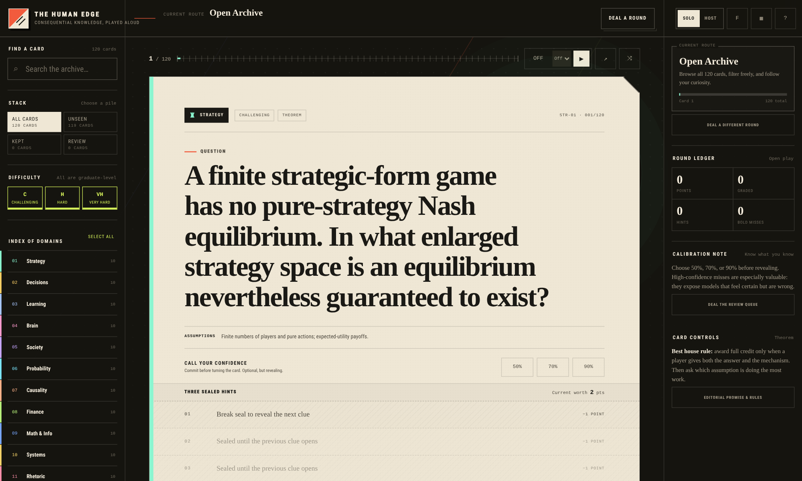

# The Human Edge

> **Consequential knowledge, played aloud.**

The Human Edge is a browser-based trivia game about ideas that materially improve judgment, learning, strategy, communication, financial reasoning, systems thinking, and digital self-defense.

It contains **120 objective, evidence-grounded questions** across **12 domains**, with three progressive hints per card, explicit assumptions, concise mechanisms, practical takeaways, source trails, solo calibration, and a full host mode for playing with friends.



## Why this exists

Most trivia rewards recall without transfer. Most self-improvement content rewards confidence without verification.

The Human Edge is built around a stricter editorial promise:

- Every card aims at a **checkable answer**, not a matter of taste.
- The assumptions doing the work are stated when they matter.
- The answer includes the **mechanism**, not merely the keyword.
- Experimental findings are scoped to the conditions that support them.
- Every card ends with a practical reason the idea changes decisions.
- Sources are attached directly to the answer.

The goal is not merely to know more facts. It is to notice bad reasoning earlier, learn more durably, coordinate more intelligently, and become less easy to fool—including by yourself.

## Play it

The app has no build step and no external runtime dependencies.

### Fastest start

1. Download or clone the repository.
2. Serve the repository root with any static server:

```bash
python -m http.server 8000
```

3. Open `http://localhost:8000`.

Opening `index.html` directly also works in many browsers, but a local server gives more consistent browser-storage behavior.

### Publish with GitHub Pages

The repository is ready to serve as a static site:

1. Put `index.html` at the publishing root.
2. Open **Settings → Pages** in the GitHub repository.
3. Choose **Deploy from a branch**.
4. Select the desired branch and the repository root.

GitHub Pages can publish plain HTML, CSS, and JavaScript directly from a repository. See the [official GitHub Pages documentation](https://docs.github.com/en/pages/getting-started-with-github-pages/creating-a-github-pages-site).

## The 12 domains

| # | Domain | What it trains |
|---:|---|---|
| 01 | Strategy & Negotiation | Equilibria, auctions, bargaining, voting, strategic information |
| 02 | Judgment & Decision-Making | Base rates, value of information, framing, bias, choice under uncertainty |
| 03 | Learning & Memory | Retrieval, spacing, interference, consolidation, durable knowledge |
| 04 | Brain, Attention & Perception | Awareness, attention, prediction, sensory measurement |
| 05 | Social Dynamics & Networks | Norms, selection, diffusion, local incentives, collective outcomes |
| 06 | Probability & Statistical Literacy | Sampling, testing, uncertainty, waiting times, misleading averages |
| 07 | Causality & Scientific Reasoning | Confounding, experiments, identification, selection, research integrity |
| 08 | Finance & Economics | Compounding, leverage, discounting, incentives, risk, capital allocation |
| 09 | Mathematics, Information & Computation | Convexity, entropy, infinity, computability, heavy tails |
| 10 | Organizations, Operations & Systems | Queues, bottlenecks, reliability, projects, feedback, incentives |
| 11 | Rhetoric, Logic & Communication | Validity, implication, hidden premises, persuasion, risk communication |
| 12 | Digital Self-Defense & Adversarial Thinking | Authentication, cryptography, injection, backups, threat modeling |

There is deliberately no ordinary “easy” tier. **Challenging** is the floor; the remaining tiers are **Hard** and **Very Hard**.

## Ways to play

### Solo: calibration practice

1. Read the card without opening a hint.
2. Call your confidence: **50%**, **70%**, or **90%**.
3. Answer aloud or write down your answer.
4. Open hints only when necessary; each hint reduces the card’s value by one point.
5. Turn the card.
6. Grade yourself **Missed**, **Close**, or **Nailed**.

High-confidence misses are especially useful. They reveal beliefs that feel like knowledge but are not yet reliable.

### Host mode: play with friends

1. Switch from **Solo** to **Host**.
2. Add two to four teams and edit their names.
3. Choose a route or deal a custom round.
4. Read only the question. The active team may request hints.
5. Turn the card and award full or partial credit.
6. Pass to the next team.

Recommended house rule: award full credit only when a player gives both **the answer and the mechanism**. After revealing, ask which assumption is doing the most work and what would change if it failed.

## Curated routes

- **The Salon** — a 12-card cross-domain mix.
- **Cold Reason** — decisions, probability, and causality.
- **The Operator’s Cut** — strategy, systems, finance, and security.
- **The Inner Lab** — learning, brain, society, and rhetoric.
- **The Deep End** — Very Hard cards only.
- **The Return** — a personal queue of misses, close calls, and kept cards.
- **Custom Cut** — any combination of filters and round length.

## Features

- 120 questions and 360 progressive hints
- click-the-card or button-based answer reveal
- solo confidence calls and self-grading
- persistent seen, kept, retired, and review states
- curated and custom rounds
- round summaries and scoring
- two-to-four-team host mode
- full and partial credit controls
- optional 30-, 60-, and 90-second timer
- searchable question archive
- domain, difficulty, and study-stack filters
- random unseen-card selection
- direct links to individual cards through URL hashes
- progress export and import
- fullscreen and focus modes
- responsive mobile drawers and bottom controls
- keyboard navigation
- reduced-motion support
- print-friendly answer layout
- no analytics, accounts, ads, or network dependency for gameplay

## Keyboard controls

| Key | Action |
|---|---|
| `H` | Reveal the next hint |
| `1`–`3` | Address a hint position in the progressive sequence |
| `A` or `Space` | Reveal the answer |
| `←` / `→` | Previous / next card |
| `R` | Random unseen card |
| `K` | Keep or unkeep the card |
| `M` | Retire or restore the card |
| `G` | Open the full archive |
| `D` | Deal a round |
| `F` | Toggle focus mode |
| `T` | Start or pause the timer |
| `?` | Open keyboard help |

## Architecture

The production app is intentionally simple:

- **one standalone `index.html`** containing the UI, styles, application code, and an embedded copy of the question bank;
- **plain HTML, CSS, and JavaScript** with no framework or package manager required;
- native `<dialog>` elements for modal flows;
- `localStorage` for on-device progress, with graceful fallback when storage is unavailable;
- progressive enhancement for view transitions;
- CSS-only visual texture and identity—no external fonts or image dependencies.

The question bank is also kept as editable JSON in `data/questions.json`. The embedded copy lets the app work offline and from static hosting without an asynchronous data-loading step.

## Repository layout

```text
.
├── index.html                  # Complete playable app
├── README.md
├── .nojekyll                   # Serve files as-is on GitHub Pages
├── data/
│   └── questions.json          # Editable question and source data
├── docs/
│   ├── preview.png
│   ├── editorial-audit.md
│   └── question-bank.md
└── scripts/
    ├── sync_questions.py       # Embed data/questions.json into index.html
    └── verify.py               # Validate the bank and embedded build
```

## Editing the question bank

Each question contains the answer, mechanism, three hints, practical transfer, evidence type, source references, and optional assumptions.

A simplified entry looks like this:

```json
{
  "id": "STR-01",
  "category": "STR",
  "difficulty": "Challenging",
  "points": 2,
  "question": "A finite strategic-form game has no pure-strategy Nash equilibrium. In what enlarged strategy space is an equilibrium nevertheless guaranteed to exist?",
  "answer": "The space of mixed strategies.",
  "explanation": "...",
  "hints": ["...", "...", "..."],
  "takeaway": "...",
  "assumptions": "Finite numbers of players and pure actions; expected-utility payoffs.",
  "evidence": "Theorem",
  "sources": ["nash1950"]
}
```

After changing `data/questions.json`, rebuild the embedded bank:

```bash
python scripts/sync_questions.py
python scripts/verify.py
```

## Editorial contribution standard

A proposed card should pass all of these tests:

1. **Objective:** a competent evaluator can determine whether an answer is correct.
2. **Consequential:** knowing the result can improve a real decision, skill, or protection strategy.
3. **Scoped:** important assumptions and boundary conditions are explicit.
4. **Mechanistic:** the explanation says why the answer follows.
5. **Hintable:** three clues can reveal structure without merely restating the answer.
6. **Sourced:** nontrivial factual claims point to a primary source, authoritative review, standard, or transparent derivation.
7. **Transferable:** the takeaway identifies a practical change in reasoning or behavior.
8. **Nonredundant:** the card adds a distinct mental model rather than another name for an existing one.

Before opening a content pull request, run:

```bash
python scripts/verify.py
```

## Privacy and saved progress

The app sends no gameplay data anywhere. Seen cards, confidence calls, grades, teams, and preferences are stored locally in the browser. Players can export that ledger as JSON, import it on another device, or erase it from the interface.

Browser storage is origin-specific. Moving between `localhost`, a custom domain, and a GitHub Pages domain creates separate local ledgers unless progress is exported and imported.

## Accessibility

The interface includes semantic landmarks, a skip link, native modal dialogs, visible keyboard focus, labeled controls, live announcements, large primary targets, responsive layouts, reduced-motion handling, and non-color status cues.

Accessibility work is ongoing. Reports with a browser, operating system, assistive technology, and reproducible steps are particularly valuable. The implementation is informed by [WCAG 2.2](https://www.w3.org/WAI/WCAG22/quickref/).

## Content provenance

The question archive combines direct mathematical derivations, classic primary papers, authoritative reviews, official standards, and current operational guidance. Source links are displayed on each revealed card.

The editorial audit documents what was retained, tightened, replaced, and added during expansion from the original 50-card set.

## Roadmap

Potential future directions:

- language packs without weakening source traceability;
- optional spaced-review scheduling;
- shareable round seeds;
- community-authored expansion packs;
- a printable physical deck;
- automated link checking and content-schema tests in CI;
- richer session analytics that remain entirely local.

## Contributing

Issues and pull requests are welcome once contribution and licensing policies are selected. Useful contributions include:

- corrections with high-quality sources;
- better wording that removes ambiguity without lowering difficulty;
- accessibility fixes;
- browser-compatibility fixes;
- new objective cards that satisfy the editorial standard;
- tests for scoring, persistence, filtering, dialogs, and mobile behavior.

Please separate content corrections from large visual or architectural changes when possible; it makes review and source verification much easier.

---

**The Human Edge** — no hot takes, no vibes, no philosophical riddles disguised as facts. Just difficult questions worth being wrong about once.
